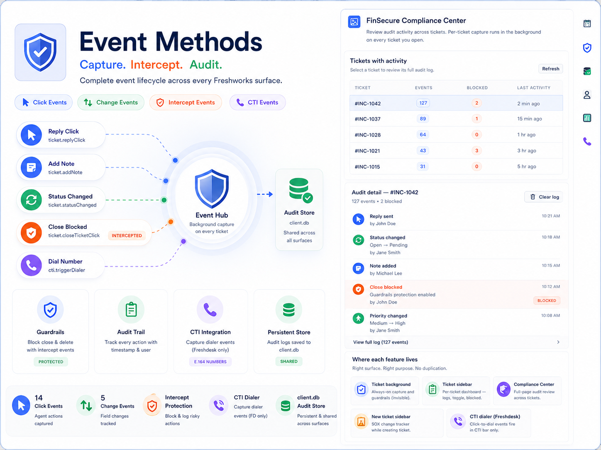

<p align="center">
  
</p>

# Events Method Samples — FinSecure Compliance

A Freshworks Platform 3.0 sample app that demonstrates **Events Methods** for regulated support teams — click, change, and intercept listeners plus CTI dialer integration — with audit logging persisted to **`client.db`**.

## Description

FinSecure Bank must capture agent actions on tickets, block destructive operations, log field changes for SOX reporting, and integrate click-to-dial — each on the Freshworks surface where the platform actually fires those events. This app maps capabilities to the correct placeholder instead of cramming everything into one narrow sidebar. See [`usecase.md`](usecase.md) for the full FinSecure operational scenarios.

### Core Functionality

1. **Always-on capture (`ticket_background`)** — silent click, change, and intercept listeners on every ticket page.
2. **Per-ticket dashboard (`ticket_sidebar`)** — guardrails toggle, action log, blocked attempts.
3. **Compliance Center (`full_page_app`)** — cross-ticket audit review for supervisors.
4. **New-ticket tracker** — SOX change log and HR routing coaching on the new-ticket page.
5. **CTI dialer (`cti_global_sidebar`)** — displays E.164 numbers from `cti.triggerDialer` (Freshdesk only).

## Features

- **14 click events** — reply, forward, note, timer, navigation, and properties actions logged per ticket.
- **5 change events** — priority, status, group, assignee, and type with `{ old, new }` from `event.helper.getData()`.
- **Intercept guardrails** — `ticket.closeTicketClick` and `ticket.deleteTicketClick` blocked when protection is on.
- **Shared `client.db` store** — background writes logs; sidebar and full-page read the same keys.
- **3-second sidebar polling** — action log refreshes while the compliance panel is open.
- **HR coaching banner** — new-ticket surface warns when group is not an approved HR queue.
- **Dev fallback** — in-memory store when `client.db` returns status `0` during local `fdk run`.

## User Interfaces

| Surface | Placement | Behavior |
| --- | --- | --- |
| `app/views/background.html` | `support_ticket.ticket_background`, `service_ticket.ticket_background` | Invisible listener — capture + guardrails → `client.db` |
| `app/views/ticket-sidebar.html` | `ticket_sidebar` (Freshdesk + Freshservice) | Guardrails toggle, per-ticket action log, blocked tab |
| `app/views/compliance-center.html` | `common.full_page_app` | Cross-ticket audit table and detail view |
| `app/views/new-ticket.html` | `support_ticket.new_ticket_requester_info`, `service_ticket.new_ticket_sidebar` | Priority/status/group/assignee/type change tracker |
| `app/views/cti.html` | `common.cti_global_sidebar` | Click-to-dial number display (Freshdesk only) |

Capture runs even when the sidebar is closed because `ticket_background` registers listeners on every ticket activation.

## Platform 3.0 Features Used

### 1. Click Events — Agent Action Audit

Registered in `app/scripts/lib/compliance-events.js` from `ticket_background`:

```javascript
client.events.on('ticket.replyClick', handler);
client.events.on('ticket.sendReply', handler);
client.events.on('ticket.addNote', handler);
client.events.on('ticket.startTimer', handler);
// … 14 click events total
```

Each handler resolves the ticket id via `client.data.get('ticket')` and appends a labeled entry to `client.db`.

### 2. Change Events — Field-Level SOX Logging

```javascript
client.events.on('ticket.priorityChanged', handler);
// event.helper.getData() → { old, new }
```

Change handlers format `old → new` for priority, status, group, assignee, and type. The new-ticket surface renders the same events in a live table for agents creating tickets.

### 3. Intercept Events — Close and Delete Guardrails

```javascript
client.events.on('ticket.closeTicketClick', handler, { intercept: true });
client.events.on('ticket.deleteTicketClick', handler, { intercept: true });
```

When guardrails are enabled (default **on**), close and delete are blocked, logged under the **Blocked** tab, and surfaced via `client.interface.trigger('showNotify', …)`.

### 4. CTI Events — Click-to-Dial (Freshdesk Only)

```javascript
client.events.on('cti.triggerDialer', handler);
// event.helper.getData().number — E.164 phone number
```

`cti.triggerDialer` only fires in `cti_global_sidebar`. It cannot be received from the ticket sidebar or background placement.

### 5. App Lifecycle Events

| Event | Where used | Purpose |
| --- | --- | --- |
| `app.activated` | Sidebar, full page, CTI, new ticket | Resize instance, load stored data, register one-time listeners |
| `ticket.updated` | Ticket sidebar | Refresh audit log after ticket changes |
| `ticket.propertiesLoaded` | Ticket sidebar | Refresh log when properties panel loads |

### 6. Key-Value Storage — Audit Persistence

`app/scripts/lib/compliance-store.js` writes to `client.db`:

| Key pattern | Contents |
| --- | --- |
| `settings:guardrails` | `'true'` / `'false'` — global close/delete protection |
| `ticket:{id}:log` | Up to 200 audit entries per ticket |
| `ticket:{id}:blocked` | Up to 50 blocked-action entries |
| `audit:ticket-index` | Up to 100 tickets with event/blocked counts for Compliance Center |

### 7. Crayons UI Components

| Component | Usage |
| --- | --- |
| `<fw-button>` | Refresh log, clear log, clear dialer |
| `<fw-tabs>` | Action log / Blocked tabs in ticket sidebar |
| `<fw-toggle>` | Guardrails on/off |
| `<fw-label>` | Protected status pill, dialer status, timestamps |
| `<fw-icon>` | FinSecure shield branding in sidebar header |

Sidebar height expands to **700px** via `client.instance.resize`. CTI surface resizes to **400×400px**.

## Project Structure

```
├── app/
│   ├── views/
│   │   ├── background.html           # ticket_background — no visible UI
│   │   ├── ticket-sidebar.html       # Per-ticket compliance dashboard
│   │   ├── compliance-center.html    # Full-page supervisor audit view
│   │   ├── new-ticket.html           # New-ticket change tracker + HR coaching
│   │   └── cti.html                  # CTI dialer number display
│   ├── scripts/
│   │   ├── lib/
│   │   │   ├── compliance-events.js  # Event registration (click/change/intercept)
│   │   │   └── compliance-store.js   # client.db persistence + dev memory fallback
│   │   ├── background.js             # Boots background listeners on init
│   │   ├── ticket-sidebar.js         # Guardrails UI, log render, polling
│   │   ├── compliance-center.js      # Ticket index table + detail drill-down
│   │   ├── new-ticket.js             # Change-event table on new-ticket surfaces
│   │   └── cti.js                    # cti.triggerDialer handler
│   └── styles/
│       ├── common.css
│       ├── ticket-sidebar.css
│       ├── compliance-center.css
│       ├── new-ticket.css
│       ├── cti.css
│       └── images/icon.svg
├── config/
│   └── iparams.json                  # Empty — no install params required
├── manifest.json                     # support_ticket + service_ticket + common
├── usecase.md
└── README.md
```

## Prerequisites

- [Freshworks CLI (FDK)](https://developers.freshworks.com/docs/app-sdk/v3.0/support_ticket/basic-dev-tools/freshworks-cli/) v10.1.2 or later
- Node.js v24.x
- Freshdesk and/or Freshservice trial accounts

Enable global apps before local development:

```bash
fdk config set global_apps.enabled true
```

## Local Development

1. Clone the repository:
   ```bash
   git clone <repo-url>
   cd events-method-samples
   ```

2. Validate and run:
   ```bash
   fdk validate
   fdk run
   ```

3. Open Freshdesk or Freshservice with `?dev=true`:

   | Test | Where |
   | --- | --- |
   | Ticket capture + sidebar | Open a ticket → **FinSecure Compliance** in right sidebar |
   | Compliance Center | Apps menu (left nav) → full-page app |
   | New-ticket tracker | New ticket page → requester info (FD) or sidebar (FS) |
   | CTI dialer (Freshdesk only) | Bottom-left phone icon → click a number on a ticket |

4. Trigger sample events on a ticket:
   - Open **Reply** or **Add note** → click event logged
   - Change **Priority** or **Status** → change event with old/new values
   - Attempt **Close** or **Delete** with guardrails on → blocked + notify toast

## Implementation Steps

1. **Background registration** — `background.js` calls `FinSecureEvents.registerTicketDetailEvents(client, FinSecureStore)` once per ticket page load.
2. **Log append** — each handler writes `{ title, variant, event, time }` to `ticket:{id}:log` and updates `audit:ticket-index`.
3. **Sidebar review** — `ticket-sidebar.js` polls `client.db` every 3s and renders Action log / Blocked tabs.
4. **Guardrails toggle** — `fw-toggle` writes `settings:guardrails`; intercept handlers read it before allowing close/delete.
5. **Supervisor view** — Compliance Center reads the ticket index and drills into per-ticket logs on row click.
6. **CTI surface** — `cti.js` listens only on `cti_global_sidebar` for `cti.triggerDialer`.

## Testing

```bash
fdk validate
```

Manual smoke test checklist:

1. Open a ticket with `?dev=true` — perform reply/note/change actions — verify sidebar log updates.
2. Toggle guardrails off — close/delete should proceed; toggle on — attempts appear under **Blocked**.
3. Open Compliance Center — ticket index lists captured activity.
4. On Freshdesk, open CTI bar and click a ticket phone number — dialer panel shows E.164 value.

Reset local storage when re-testing audit data:

```bash
rm .fdk/store.sqlite
fdk run
```

## Key Learnings

1. **Surface-specific events** — `cti.triggerDialer` only fires in `cti_global_sidebar`; intercept events require `{ intercept: true }`.
2. **Background + sidebar split** — put always-on listeners in `ticket_background`; use sidebar for agent-facing review UI.
3. **Shared storage** — background writes and sidebar reads the same `client.db` keys per ticket ID.
4. **One registration guard** — `compliance-events.js` uses a `registered` flag so listeners are not attached twice on re-activation.
5. **Change payload shape** — `event.helper.getData()` returns `{ old, new }` for all `*Changed` ticket events.

## Resources

- [Events method](https://developers.freshworks.com/docs/app-sdk/v3.0/common/client/events-method/)
- [Key-value storage (`client.db`)](https://developers.freshworks.com/docs/app-sdk/v3.0/common/client/db/)
- [Interface methods — showNotify](https://developers.freshworks.com/docs/app-sdk/v3.0/support_ticket/front-end-apps/interface-methods/)
- [usecase.md](./usecase.md)
