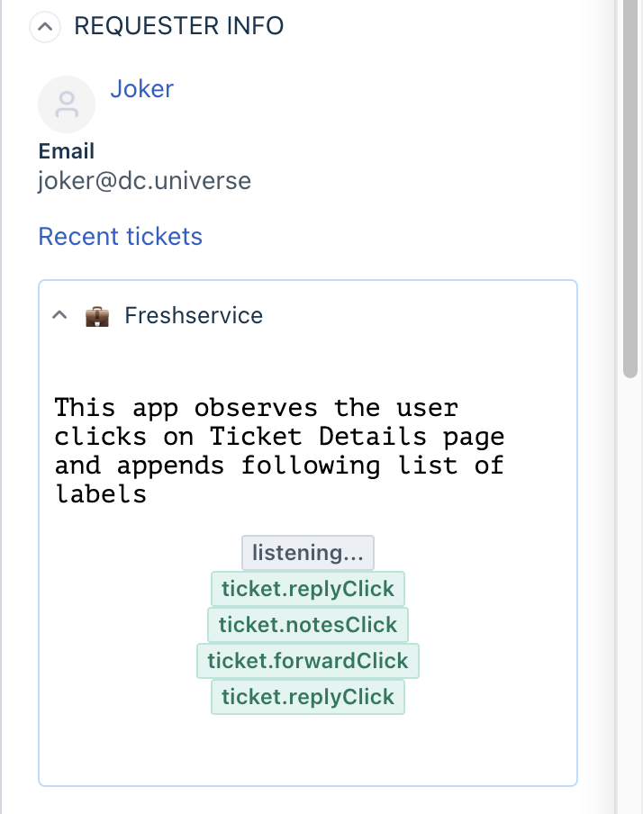

# Events Methods for Freshservice

### Description:

You can observe events that occur in the Freshservice UI and register a callback with events methods.
`client.events.on("<argument>", callback[,options])` - takes in a callback which will be invoked when desired event occured.

Events method can observe 3 types of events

1. Click Events
2. Change Events

### Screenshots:

#### Events in Ticket Details Page

<article align="center">


</article>

### Events in New Incident Create page

<article align="center">



</article>

### Prerequisites:

1. Make sure you have [tools required to start building Freshworks Apps](https://community.developers.freshworks.com/t/tools-required-to-start-building-freshworks-apps/3585)
2. Ensure that you have the [Freshworks CLI](https://community.developers.freshworks.com/t/what-are-the-prerequisites-to-install-the-freshworks-cli/234) installed properly.

### Procedure to run the app:

```sh
# Run the app
> fdk run
# app runs on localhost:10001 and sample config page is rendered on /custom_configs
```

### Common discussions:

1. Intercept events are not yet support in when Freshservice is hosting your app.
